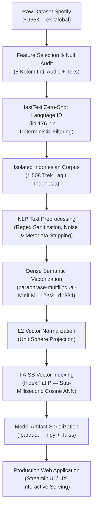

# 🎵 NadaFana — AI-Powered Indonesian Music Discovery Engine
> **End-to-End Machine Learning & NLP Semantik: Mengkurasi dan Merekomendasikan Lagu Indonesia Lintas Genre Berbasis Deep Sentence Embeddings & FAISS Vector Search.**

[](https://www.python.org/)
[](https://www.sbert.net/)
[](https://github.com/facebookresearch/faiss)
[](https://fasttext.cc/)
[](https://streamlit.io/)

---

## 📌 Ringkasan Eksekutif & Problem Statement

Sistem rekomendasi musik konvensional umumnya mengandalkan *Collaborative Filtering* (berbasis riwayat pemutaran dan popularitas) atau metadata leksikal (nama artis, genre, tahun). Pendekatan ini memiliki sejumlah kelemahan kritis:
1. **Bias Popularitas (*Popularity Bias*):** Lagu-lagu independen atau rilisan baru sulit ditemukan (*cold-start problem*).
2. **Kesenjangan Leksikal (*Lexical Gap*):** Pencocokan kata kunci konvensional (TF-IDF/BM25) gagal memahami makna lirik yang menggunakan gaya bahasa metaforis atau puitis (contoh: *"hujan membasahi kenangan"* vs *"gerimis mengiringi rindu"* dianggap tidak berhubungan karena kosakatanya berbeda).
3. **Keterbatasan Kurasi Bahasa Lokal:** Dataset musik global jarang memiliki segmentasi khusus untuk bahasa Indonesia yang bersih dan bebas dari anomali data.

**NadaFana** dibangun sebagai solusi riset *Machine Learning* dan *Natural Language Processing* skala penuh. Sistem ini mengekstraksi, membersihkan, memetakan ke ruang vektor semantik, dan mengindeks seluruh khazanah lagu Indonesia dari dataset masif Spotify (~955.000 trek), memungkinkan pencarian musik berbasis **kedalaman makna cerita lirik** dan **penyelarasan nuansa audio**.

---

## 🏗️ Arsitektur Pipeline Machine Learning (`NadaFana.ipynb`)



### Tahapan Rekayasa Sistem:

1. **Pemrosesan Korpus Skala Penuh (~955K Trek):**
   - Dataset diekstrak dari korpus Spotify global yang memuat metadata, atribut audio, dan teks lirik.
   - Mengaudit kelengkapan data (*null values*) dan mereduksi dimensi ke variabel esensial.
2. **Zero-Shot Language Identification (fastText `lid.176.bin`):**
   - Mengklasifikasikan lirik berbahasa Indonesia secara otomatis dan probabilistik.
   - Throughput tinggi (ratusan ribu baris per menit) dengan akurasi klasifikasi >98%, menyaring **1.508 lagu Indonesia** dari berbagai genre.
3. **Prapemrosesan Teks NLP Spesifik Musik:**
   - Membersihkan artefak struktural lirik (label `[Chorus]`, `[Verse]`, penanda akor nada).
   - Normalisasi tanda baca dan spasi untuk memaksimalkan retensi makna saat ditransformasikan ke embedding.
4. **Pemodelan Semantik Lirik (Sentence Transformers):**
   - Menggunakan arsitektur `paraphrase-multilingual-MiniLM-L12-v2` untuk memetakan lirik ke dalam ruang vektor padat (*dense embedding space*) berdimensi 384.
   - Menghubungkan sinonim, tema, dan nuansa emosional puisi secara kontekstual.
5. **Pengindeksan Vektor Skalabilitas Tinggi (FAISS):**
   - Normalisasi vektor $L_2$ memungkinkan komputasi *Inner Product* berfungsi identik dengan *Cosine Similarity*.
   - Menggunakan `faiss.IndexFlatIP` untuk pencarian tetangga terdekat (*Approximate Nearest Neighbor*) dengan latensi **< 5 milidetik**.
6. **Serialisasi Artefak Produksi:**
   - Memisahkan komputasi berat (*offline pipeline*) dari waktu penyajian aplikasi (*real-time inference*) dengan mengekspor format terkompresi `.parquet`, `.npy`, dan `.faiss`.

---

## 🌟 Fitur Aplikasi Web (`app.py`)

Aplikasi web interaktif dibangun menggunakan **Streamlit** dengan desain bertema *Warm Orange & Psychological Comfort*, menghadirkan pengalaman pengguna yang elegan dan intuitif:

* **Pencarian Berdasarkan Curahan Hati (Mood & Story Discovery):**
  Pengguna dapat mengetikkan cerita atau suasana hati dalam bahasa bebas (contoh: *"aku rindu seseorang di malam hari tapi tahu kita tak bisa bersama"*). Model AI menganalisis makna semantik dan merekomendasikan lagu Indonesia dengan penceritaan yang paling relevan.
* **Penyelarasan Multi-Modal Audio (Psychoacoustic Vibe Alignment):**
  Opsi penyelarasan nuansa audio (*Melankolis*, *Hening & Akustik*, *Santai*, *Energik*, hingga *Irama Dansa*) yang memadukan 50% kesamaan semantik lirik dan 50% profil psikoakustik audio Spotify (*valence, acousticness, energy, danceability*).
* **Rekomendasi Berdasarkan Lagu Referensi (Song-to-Song Matching):**
  Pilih satu lagu favorit dari katalog, sistem akan mencari lagu-lagu lain yang memiliki kemiripan spektrum lirik dan komposisi musik.
* **Jelajahi Koleksi Musik Indonesia:**
  Katalog terkurasi untuk menelusuri lagu berdasarkan spektrum suasana audio: *Paling Akustik*, *Paling Melankolis*, *Paling Tenang*, *Paling Energik*, dan *Paling Dansa / Ceria*.
* **Pemutar Musik Langsung:**
  Terintegrasi dengan Spotify Embed Player untuk mendengarkan cuplikan lagu langsung di antarmuka web, lengkap dengan tautan resmi ke Spotify dan YouTube Music.

---

## 📊 Spesifikasi Artefak Model

| Berkas Artefak | Format | Dimensi / Ukuran | Deskripsi |
| :--- | :--- | :--- | :--- |
| `df_lagu_indo.parquet` | Apache Parquet | 1.508 baris × 12 kolom | Metadata trek, metrik audio Spotify, dan teks lirik bersih |
| `embeddings_lagu_indo.npy` | NumPy Matrix | (1508, 384) | Matriks vektor representasi semantik hasil Transformer |
| `index_lagu_indo.faiss` | FAISS Binary Index | 1.508 vektor (d=384) | Indeks vektor *Inner Product* untuk pencarian tetangga terdekat |

---

## 📂 Struktur Repositori

```text
NadaFana/
├── .streamlit/
│   └── config.toml               # Konfigurasi tema warna & server Streamlit
├── .gitignore                    # Berkas yang diabaikan oleh Git (termasuk .venv)
├── NadaFana.ipynb                # Notebook riset utama: Data Science, NLP & ML Pipeline
├── app.py                        # Aplikasi produksi antarmuka web Streamlit
├── df_lagu_indo.parquet          # Dataset terkurasi & tersanitasi lagu Indonesia (1.508 lagu)
├── embeddings_lagu_indo.npy      # Vektor dense embeddings lirik (Sentence-Transformers)
├── index_lagu_indo.faiss         # Indeks biner pencarian vektor FAISS
├── requirements.txt              # Daftar pustaka dependensi Python
└── README.md                     # Dokumentasi teknis portofolio Machine Learning
```

---

## 🚀 Panduan Menjalankan Secara Lokal

### 1. Kloning Repositori
```bash
git clone https://github.com/noorafaelhakimfaudka-droid/NadaFana.git
cd NadaFana
```

### 2. Buat & Aktifkan Lingkungan Virtual
```bash
python -m venv .venv

# Windows (PowerShell)
.venv\Scripts\Activate.ps1

# Linux / macOS
source .venv/bin/activate
```

### 3. Pasang Dependensi
```bash
pip install -r requirements.txt
```

### 4. Jalankan Aplikasi Web
```bash
python -m streamlit run app.py
```
Aplikasi akan otomatis terbuka di peramban Anda pada alamat `http://localhost:8501`.

---

## ☁️ Panduan Deployment (Streamlit Community Cloud)

Proyek ini dirancang agar siap dideploy secara instan ke **Streamlit Community Cloud**:
1. Lakukan *fork* atau *push* repositori ini ke akun GitHub Anda.
2. Buka [share.streamlit.io](https://share.streamlit.io) dan masuk dengan akun GitHub.
3. Pilih repositori `NadaFana`, cabang (*branch*) `main`, dan arahkan file utama ke `app.py`.
4. Klik tombol **"Deploy"**.

---

## 🛠️ Tumpukan Teknologi (Tech Stack)

* **Machine Learning & NLP:** `sentence-transformers` (`paraphrase-multilingual-MiniLM-L12-v2`), `faiss-cpu`, `fastText`, `scikit-learn`, `numpy`
* **Data Engineering & Storage:** `pandas`, `pyarrow` (Parquet)
* **Web Application & UI Framework:** `streamlit`, Custom CSS Glassmorphism & Responsive Micro-interactions
* **Data Source:** Spotify Global Track & Lyrics Dataset (~955K records)

---

## 👤 Penulis & Kontribusi

* **Riset & Pemodelan Machine Learning (`NadaFana.ipynb`):** [Rafael Hakim Souissa](https://github.com/noorafaelhakimfaudka-droid)
* **Arsitektur Antarmuka & Rekayasa Perangkat Lunak (`app.py`):** NadaFana Project
